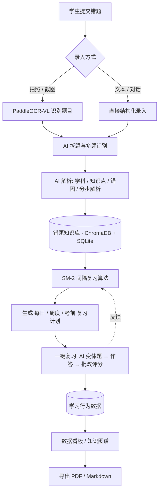
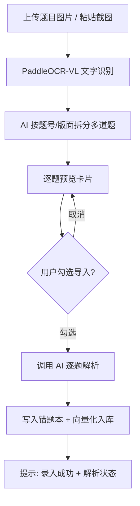
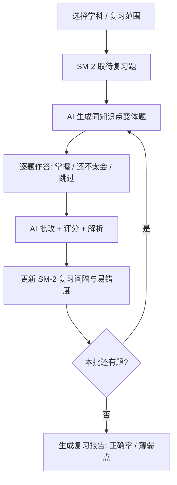
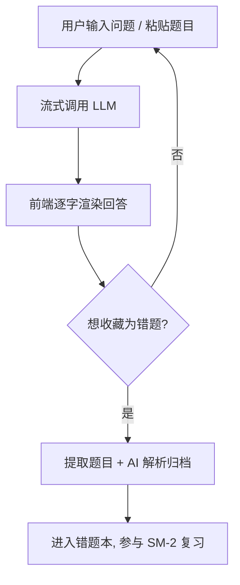
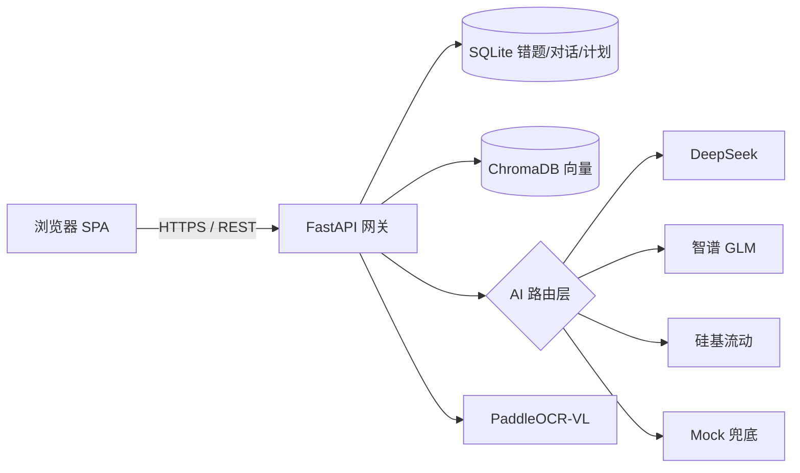

# Recall AI 智能错题本 · 产品需求文档（PRD）

> 版本：v1.0（MVP 基线）  
> 文档类型：产品需求文档（PRD）  
> 维护人：AI 产品经理  
> 最后更新：2026-08-13


---

## 1. 产品背景与目标

### 1.1 产品背景

学生（尤其是初高中、备考群体）在日常练习与考试中会产生大量错题，传统错题本存在三大核心痛点：

- **录入成本高**：手抄题目耗时、拍照后需手动整理，日均浪费 30–60 分钟；
- **归因弱**：多数学生只记录"正确答案"，缺乏系统化的**错因分析**与**知识点关联**，同类错误反复出现；
- **复习无计划**：凭感觉复习，遗忘曲线未被科学管理，考前"突击"效率低下。

Recall 旨在通过 **AI 录入 + AI 解析 + 科学复习算法（SM-2）** 打通"录入 → 理解 → 复习 → 巩固"闭环，把学生从机械劳动中解放出来，把精力聚焦在"真正不会的知识点上"。

### 1.2 产品目标

| 维度   | 目标                                         |
| ---- | ------------------------------------------ |
| 核心目标 | 让学生 10 秒内完成一道错题的录入与归档，5 秒内获得 AI 错因分析       |
| 效率目标 | 相比手抄错题本，录入效率提升 ≥ 10×，复习计划生成从"手动规划"降为"一键生成" |
| 效果目标 | 通过 SM-2 算法将知识点长期留存率提升至 90%+（艾宾浩斯理论基线）      |
| 商业目标 | 成为学生端"错题管理 + 个性化辅导"入口，沉淀学习数据资产             |

### 1.3 产品定位

- **一句话定位**：会自己思考的 AI 错题本——拍照即归档，AI 帮你分析错在哪、怎么练、何时复习。
- **形态**：Web 端（响应式，主用桌面/平板），本地优先存储，AI 能力可选云端。
- **边界**：不做"完整题库/组卷系统"，聚焦"个人错题的智能化管理"，AI 仅作为解析/生成/批改增强，不替代教师。

---

## 2. 目标用户画像

### 2.1 核心用户画像

| 画像            | 身份          | 核心诉求               | 使用频率     | 关键场景                   |
| ------------- | ----------- | ------------------ | -------- | ---------------------- |
| **备考学生（主）**   | 初三/高三/考研/考证 | 快速归集错题、精准查漏、考前高效复习 | 每日 1–3 次 | 晚自习整理当日错题；考前按学科生成复习计划  |
| **日常学生**      | 小学高年级–高二    | 降低抄题负担、获得讲解        | 每周 3–5 次 | 作业错题拍照录入，AI 给分步解析      |
| **自学成人**      | 职场考证/语言学习   | 知识点结构化、间隔复习        | 每周 2–4 次 | 外语错题、公考错题的积累与复习        |
| **（潜在）家长/老师** | 辅助角色        | 查看孩子薄弱点、导出报告       | 低频       | 通过数据看板了解知识图谱，导出 PDF 辅导 |

### 2.2 用户痛点—需求映射

```
痛点：抄题慢 ───────────► 需求：拍照/OCR 一键录入
痛点：不会分析错因 ─────► 需求：AI 拆解学科/知识点/错因
痛点：复习没计划 ───────► 需求：SM-2 自动生成每日/周度/考前计划
痛点：做完没反馈 ───────► 需求：AI 变体题 + 自动批改评分
痛点：数据散乱 ─────────► 需求：看板趋势 + 知识图谱 + 导出
```

---

## 3. 业务核心逻辑

### 3.1 主业务闭环



### 3.2 核心对象关系

```
学生 1──* 错题(Mistake) *──1 学科(Subject) *──* 知识点(KnowledgePoint)
错题 1──* 复习记录(ReviewLog) ──► SM-2 计算下次复习间隔
学生 1──* 对话(Conversation) 1──* 消息(ChatMessage)
对话消息 1──1 错题(可一键转化)
```

---

## 4. 功能流程描述

### 4.1 流程一：识图录入（拍照 / 截图）



> 注：OCR 失败或图片模糊时降级为"手动文本录入"，保证主流程不中断。

### 4.2 流程二：一键复习（变体题 + 批改）



### 4.3 流程三：AI 对话（答疑 + 转错题）



---

## 5. 功能需求详情

> 优先级说明：**P0** = MVP 必须；**P1** = MVP 增强；**P2** = 后续迭代。

### 5.1 错题录入（FR-ENTRY）

| 编号          | 需求           | 描述                                          | 优先级 | 验收要点                                                 |
| ----------- | ------------ | ------------------------------------------- | --- | ---------------------------------------------------- |
| FR-ENTRY-01 | 多方式录入        | 支持 拍照/截图上传、文本粘贴、对话转错题 四种入口                  | P0  | 四种入口均可打开录入流程                                         |
| FR-ENTRY-02 | 图片识题         | 上传图片经 OCR 识别题目文本，填充录入框                      | P0  | 清晰印刷体识别准确率 ≥ 90%                                     |
| FR-ENTRY-03 | AI 拆题        | 单图含多题时 AI 拆分为独立题目卡片，支持勾选导入                  | P1  | 多题图片可逐题勾选                                            |
| FR-ENTRY-04 | AI 自动解析      | 录入时自动调用可用 AI 识别：学科、知识点、错因、分步解析              | P0  | 返回 subject/knowledge_points/error_reason/ai_analysis |
| FR-ENTRY-05 | 多供应商容错       | 任一 AI 失败自动 fallback 至下一个可用供应商；JSON 解析失败保留原文 | P0  | 单供应商故障不影响录入                                          |
| FR-ENTRY-06 | Base URL 自定义 | 每个供应商可填自定义 Base URL（中转/反代）                  | P1  | 自定义地址生效，留空走默认                                        |

### 5.2 错题本管理（FR-BOOK）

| 编号         | 需求       | 描述                                   | 优先级 | 验收要点       |
| ---------- | -------- | ------------------------------------ | --- | ---------- |
| FR-BOOK-01 | 错题列表     | 卡片式展示题目、学科、知识点、来源、复习次数               | P0  | 列表可滚动、可筛选  |
| FR-BOOK-02 | 学科/知识点筛选 | 按学科、知识点、来源过滤                         | P0  | 筛选实时生效     |
| FR-BOOK-03 | 解析展示     | 折叠展示 AI 解析，标记解析状态（✓解析 / ⚠部分解析 / ⚠降级） | P0  | 三种状态徽章正确显示 |
| FR-BOOK-04 | 编辑/删除    | 支持修改题目信息、删除错题                        | P0  | 删除有确认，列表同步 |
| FR-BOOK-05 | 分类管理     | 自定义分类/文件夹归档                          | P1  | 可建分类并归属错题  |

### 5.3 一键复习（FR-REVIEW）

| 编号           | 需求      | 描述                        | 优先级 | 验收要点      |
| ------------ | ------- | ------------------------- | --- | --------- |
| FR-REVIEW-01 | 复习计划生成  | 基于 SM-2 生成 每日/周度/考前 待复习队列 | P0  | 计划量与到期题一致 |
| FR-REVIEW-02 | 逐题复习    | 一题一题呈现，作答后标记 掌握/还不太会/跳过   | P0  | 进度条正确，不跳题 |
| FR-REVIEW-03 | AI 变体题  | 按原题知识点生成变式题               | P1  | 变体题与原题同考点 |
| FR-REVIEW-04 | AI 批改评分 | 对学生作答自动批改并给解析             | P1  | 批改结果可解释   |
| FR-REVIEW-05 | 复习结算    | 一批结束后给出正确率与薄弱点报告          | P0  | 报告数据准确    |

### 5.4 复习计划与数据看板（FR-DASH）

| 编号         | 需求   | 描述                         | 优先级 | 验收要点    |
| ---------- | ---- | -------------------------- | --- | ------- |
| FR-DASH-01 | 学习趋势 | 按时间展示录入量、复习量、正确率趋势         | P1  | 图表随数据更新 |
| FR-DASH-02 | 知识图谱 | 以学科—知识点维度展示掌握度热力           | P1  | 薄弱点可下钻  |
| FR-DASH-03 | 导出   | 支持 PDF / Markdown 导出错题本或报告 | P1  | 导出文件可打开 |

### 5.5 AI 对话（FR-CHAT）

| 编号         | 需求     | 描述                     | 优先级 | 验收要点         |
| ---------- | ------ | ---------------------- | --- | ------------ |
| FR-CHAT-01 | 流式回答   | 提问后逐字渲染 AI 回答          | P0  | 首字 < 2s，流式平滑 |
| FR-CHAT-02 | 一键转错题  | 对话中题目可一键加入错题本并触发解析     | P0  | 转错题后进入复习闭环   |
| FR-CHAT-03 | 图片识题入口 | 对话输入框支持 截图/OCR 识别题目后提问 | P1  | 图片可识别并填入     |

### 5.6 设置与帮助（FR-SET）

| 编号        | 需求         | 描述                           | 优先级 | 验收要点             |
| --------- | ---------- | ---------------------------- | --- | ---------------- |
| FR-SET-01 | API Key 管理 | 配置 DeepSeek/智谱/硅基流动 Key，仅存本地 | P0  | Key 不落库，仅随请求临时使用 |
| FR-SET-02 | 连接测试       | 每供应商「测试连接」按钮，返回 连通/原因/延迟     | P0  | 测试失败给出可读原因       |
| FR-SET-03 | 帮助中心       | 使用说明、常见问题、故障排查               | P1  | 可检索、可跳转          |

---

## 6. 非功能需求

### 6.1 性能指标

| 指标       | 目标值          | 说明                 |
| -------- | ------------ | ------------------ |
| API 常规响应 | < 500ms（P95） | 非 AI 类接口（列表/筛选/保存） |
| AI 流式首字  | < 2s         | 对话与解析的首次 token 延迟  |
| OCR 识别   | < 10s        | 单张图片端到端            |
| 首屏加载     | < 2s         | 桌面网络下 FCP          |
| 错题容量     | ≥ 10,000 条   | 本地 SQLite 单库可承载    |

### 6.2 兼容与可用性

- **浏览器**：Chrome / Edge / Firefox / Safari 最新两个大版本；
- **响应式**：桌面（≥1280）、平板（768–1279）良好；移动端（<768）核心流程可用；
- **存储**：本地优先（SQLite + localStorage），AI Key 仅存浏览器，不上传服务端；
- **可用性**：单 AI 供应商故障不影响主流程（自动 fallback）；OCR 失败降级为手动录入。

### 6.3 安全与隐私

- API Key 仅存用户本地浏览器（localStorage），每次请求临时传给后端，服务端不持久化；
- 错题数据默认本地存储，不上云；
- 第三方模型调用遵循对应平台合规要求。

---

## 7. 验收标准

### 7.1 MVP 验收清单（P0 全绿即通过）

- [ ] 四种录入入口（拍照/截图/文本/对话）均可用；
- [ ] 图片上传经 OCR 能识别并填充题目；
- [ ] 录入后 AI 自动返回 学科/知识点/错因/解析，且解析状态徽章正确；
- [ ] 单供应商 Key 失效时，系统自动 fallback 到下一个可用供应商，不中断录入；
- [ ] 错题列表可筛选、可查看解析、可删除；
- [ ] 一键复习能逐题呈现、标记掌握度、生成结算报告；
- [ ] SM-2 生成的复习计划与到期题量一致；
- [ ] AI 对话流式回答首字 < 2s，可一键转错题；
- [ ] 每供应商「测试连接」返回可读的 连通/失败原因；
- [ ] 首屏 < 2s，列表在 10,000 条数据下滚动流畅；
- [ ] 响应式在桌面/平板主流浏览器正常。

### 7.2 质量门槛

- 核心链路（录入→解析→复习）端到端冒烟测试 100% 通过；
- AI 解析 JSON 异常时保留原文，不丢题、不白屏；
- 无未捕获前端异常导致页面空白。

---

## 8. 技术方案概要

### 8.1 技术栈

| 层    | 技术                                                        | 说明                      |
| ---- | --------------------------------------------------------- | ----------------------- |
| 前端   | Vue 3 + Vite + TypeScript + Tailwind + vue-router + axios | 组件化 SPA，snake→camel 拦截器 |
| 后端   | FastAPI + Uvicorn + SQLAlchemy + SQLite                   | 轻量 REST，本地优先            |
| 向量库  | ChromaDB                                                  | 知识点/题目语义检索与去重           |
| AI   | DeepSeek / 智谱 GLM / 硅基流动（OpenAI 兼容）+ Mock 兜底              | 多供应商路由 + fallback       |
| OCR  | PaddleOCR-VL                                              | 题目文字识别（缺依赖时降级手动录入）      |
| 复习算法 | SM-2                                                      | 间隔重复，计算下次复习间隔与易错度       |

### 8.2 系统架构



### 8.3 关键设计点

- **多供应商路由**：`pickProvider` 三级选择（已测试通过 → 有 Key 且未失败 → Mock）；后端 `analyze_mistake` 按优先级轮询并 fallback；
- **容错解析**：`_safe_json_loads` 兼容 `<think>`、代码围栏、控制字符；解析失败保留原文（status=`partial`），完全无响应才降级（`fallback`）；
- **连接验证**：`/test-connection` 用最小 token 真调，区分"未配置 Key"与"调用失败"，返回可读中文原因 + 延迟；
- **本地优先**：API Key 存 localStorage，随请求临时传参；错题存本地 SQLite；
- **Base URL 可配**：每供应商支持自定义中转/反代地址，请求级 > 前端传参 > 环境变量，client 缓存 key 含 base 尾段防误用。

### 8.4 数据模型（核心）

- `Mistake`：id, content, subject, knowledge_points[], source, category_id, ai_analysis, ai_status(ok/partial/fallback), provider, reviewed, review_count
- `ReviewLog`：mistake_id, reviewed_at, result(掌握/还不太会/跳过), sm2_params(ease, interval, due)
- `Conversation` / `ChatMessage`：对话与消息，消息可转化为 Mistake
- `Category`：自定义分类

---

## 附录 A：MVP 与愿景差异说明

| 愿景功能            | 当前 MVP 状态         | 备注                  |
| --------------- | ----------------- | ------------------- |
| 拍照 OCR 一键录入     | ✅ 接口打通，⚠ OCR 依赖待装 | 缺 PaddleOCR 时降级手动录入 |
| 四方式录入           | ✅ 文本/对话/截图入口已落地   | 拍照与截图共用 OCR 通道      |
| AI 自动解析         | ✅ 多供应商 + fallback | 小模型返回非 JSON 时保留原文   |
| SM-2 复习计划       | ✅ 逐题复习已落地         | 计划聚合页待增强            |
| 数据看板/知识图谱       | 🟡 框架在，图表待完善      | P1                  |
| PDF/Markdown 导出 | 🟡 待实现            | P1                  |
| 帮助中心            | 🟡 占位             | P1                  |

> 本 PRD 同时描述产品愿景与已落地 MVP，迭代时以 P0 全绿为发布门槛，P1 按优先级滚动补齐。
